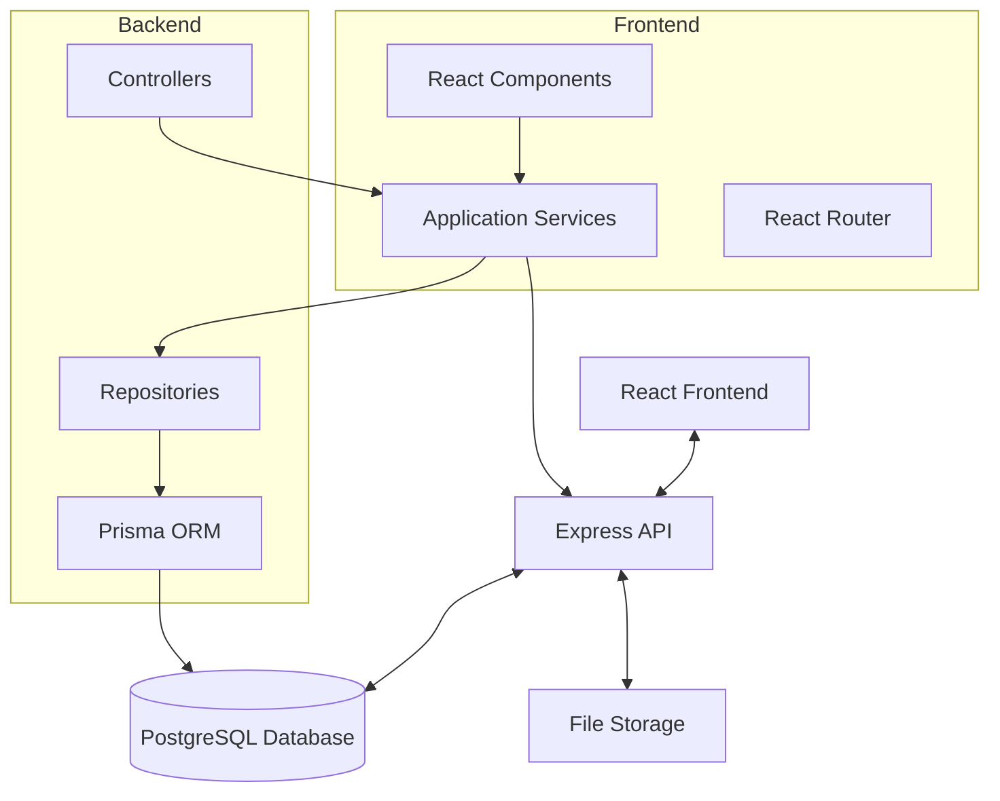
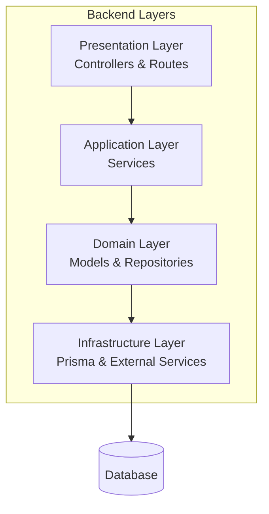

# LTI Talent Tracking System (ATS)

A comprehensive Applicant Tracking System (ATS) designed to manage the complete recruitment process, from candidate registration to interview tracking and position management.

## 📋 Table of Contents

- [Overview](#overview)
- [Project Structure](#project-structure)
- [Technologies](#technologies)
- [Architecture](#architecture)
- [Setup Instructions](#setup-instructions)
- [Testing](#testing)
- [API Documentation](#api-documentation)
- [Development](#development)
- [Contributing](#contributing)

## Overview

The LTI Talent Tracking System is a full-stack application designed to streamline the recruitment process. It provides comprehensive tools for managing candidates, positions, interview flows, and the entire hiring lifecycle.

### Key Features

- **Candidate Management**: Complete candidate profiles with education and work experience
- **Position Management**: Create and manage job positions with detailed requirements
- **Interview Tracking**: Structured interview flows with customizable steps
- **Application Tracking**: Monitor candidate applications through the hiring pipeline
- **Document Management**: Upload and manage candidate resumes and documents
- **Dashboard**: Visual representation of recruitment pipeline with drag-and-drop functionality

## Project Structure

```
AI4Devs-LTI/
├── backend/                    # Backend API server
│   ├── src/
│   │   ├── application/       # Application services
│   │   ├── domain/           # Domain models and repositories
│   │   ├── infrastructure/   # Infrastructure layer
│   │   ├── presentation/     # Controllers and routes
│   │   └── index.ts          # Application entry point
│   ├── prisma/               # Database schema and migrations
│   └── package.json
├── frontend/                  # React frontend application
│   ├── src/
│   │   ├── components/       # React components
│   │   ├── services/         # API service layer
│   │   └── assets/          # Static assets
│   ├── cypress/             # End-to-end tests
│   └── package.json
├── memory-bank/              # Project documentation
├── docker-compose.yml        # Database containerization
└── README.md
```

### Architecture Diagram



## Technologies

### Backend
- **Runtime**: Node.js with TypeScript
- **Framework**: Express.js
- **ORM**: Prisma
- **Database**: PostgreSQL
- **Testing**: Jest
- **Documentation**: Swagger/OpenAPI

### Frontend
- **Framework**: React 18 with TypeScript
- **UI Library**: React Bootstrap
- **Routing**: React Router DOM
- **HTTP Client**: Axios
- **Drag & Drop**: React Beautiful DnD
- **Testing**: Jest, Cypress

### Infrastructure
- **Containerization**: Docker & Docker Compose
- **Database**: PostgreSQL (containerized)
- **File Storage**: Local file system

## Architecture

The application follows **Domain-Driven Design (DDD)** principles with a layered architecture:

### Backend Architecture



### Key Design Patterns

1. **Repository Pattern**: Abstracts data access logic
2. **Service Layer**: Coordinates complex business operations
3. **Domain Models**: Encapsulate business logic
4. **DTO Pattern**: Data transfer objects for API communication

### Data Model

The system manages the following core entities:

- **Candidate**: Personal information, education, work experience
- **Position**: Job openings with requirements and responsibilities
- **Company**: Organizations offering positions
- **InterviewFlow**: Structured interview processes
- **Application**: Candidate applications to positions
- **Interview**: Interview results and feedback

## Setup Instructions

### Prerequisites

- Node.js (v16 or higher)
- npm or yarn
- Docker and Docker Compose
- Git

### 1. Clone the Repository

```bash
git clone <repository-url>
cd AI4Devs-LTI-workshop
```

### 2. Environment Configuration

Create a `.env` file in the root directory:

```bash
# Database Configuration
DB_USER=LTIdbUser
DB_PASSWORD=D1ymf8wyQEGthFR1E9xhCq
DB_NAME=LTIdb
DB_PORT=5432

# Backend Configuration
PORT=3010
UPLOAD_DIR=uploads
```

### 3. Database Setup

Start the PostgreSQL database using Docker:

```bash
docker-compose up -d
```

### 4. Backend Setup

```bash
# Navigate to backend directory
cd backend

# Install dependencies
npm install

# Generate Prisma client
npm run prisma:generate

# Run database migrations
npx prisma migrate dev

# Seed the database (optional)
npm run prisma:seed

# Start development server
npm run dev
```

The backend will be available at `http://localhost:3010`

### 5. Frontend Setup

```bash
# Navigate to frontend directory
cd frontend

# Install dependencies
npm install

# Start development server
npm start
```

The frontend will be available at `http://localhost:3000`

### 6. Verify Installation

1. Backend API should be running on port 3010
2. Frontend should be running on port 3000
3. Database should be accessible on port 5432
4. You can access the application at `http://localhost:3000`

## Testing

### Backend Testing

```bash
cd backend
npm test
```

### Frontend Testing

```bash
cd frontend
npm test
```

### End-to-End Testing with Cypress

```bash
cd frontend

# Open Cypress Test Runner
npm run cypress:open

# Run tests in headless mode
npm run cypress:run

# Run tests in CI mode
npm run cypress:run:headless
```

### Test Coverage

- **Unit Tests**: Jest for backend services and frontend components
- **Integration Tests**: API endpoint testing
- **E2E Tests**: Cypress for complete user workflows
- **Database Tests**: Prisma-based repository testing

## API Documentation

The API documentation is available via Swagger UI when the backend is running:

- **Swagger UI**: `http://localhost:3010/api-docs`
- **API Base URL**: `http://localhost:3010/api`

### Main Endpoints

- `GET /api/candidates` - List all candidates
- `POST /api/candidates` - Create new candidate
- `GET /api/positions` - List all positions
- `POST /api/positions` - Create new position
- `GET /api/applications` - List applications
- `POST /api/applications` - Create application

## Development

### Available Scripts

#### Backend
```bash
npm run dev          # Start development server
npm run build        # Build for production
npm run test         # Run tests
npm run prisma:generate  # Generate Prisma client
```

#### Frontend
```bash
npm start            # Start development server
npm run build        # Build for production
npm test             # Run tests
npm run cypress:open # Open Cypress test runner
```

### Code Quality

- **Linting**: ESLint configuration for both frontend and backend
- **Formatting**: Prettier for consistent code formatting
- **Type Safety**: TypeScript throughout the application

## Contributing

1. Fork the repository
2. Create a feature branch (`git checkout -b feature/amazing-feature`)
3. Commit your changes (`git commit -m 'Add some amazing feature'`)
4. Push to the branch (`git push origin feature/amazing-feature`)
5. Open a Pull Request

### Development Guidelines

- Follow TypeScript best practices
- Write tests for new features
- Update documentation as needed
- Follow the existing code style and patterns

## 📄 License

This project is licensed under the MIT License - see the [LICENSE.md](LICENSE.md) file for details.

## 🆘 Support

For support and questions:

1. Check the existing documentation
2. Review the memory-bank folder for detailed project context
3. Open an issue in the repository
4. Contact the development team

---

**Note**: This is a development version of the LTI Talent Tracking System. For production deployment, additional security measures, environment configurations, and deployment procedures should be implemented.
