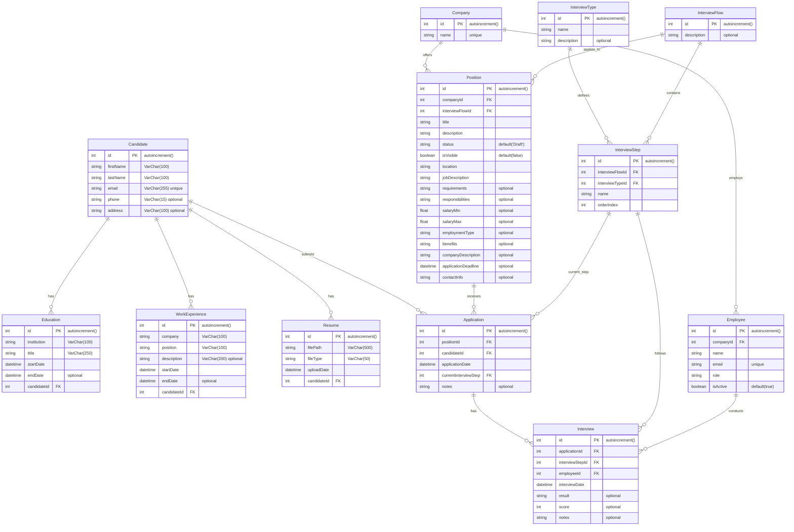

# Data Model Documentation

## Project Description

This project is a candidate and interview management system that facilitates the administration of personnel selection processes. The system manages candidate information, their work and academic experiences, as well as open positions in companies and associated interview processes.

## Database Model

### Entities and Relationships

### **Candidate**

- **id**: Unique candidate identifier (autoincrement).
- **firstName**: Candidate's first name (VarChar(100)).
- **lastName**: Candidate's last name (VarChar(100)).
- **email**: Candidate's email (VarChar(255), unique).
- **phone**: Candidate's phone number (VarChar(15), optional).
- **address**: Candidate's address (VarChar(100), optional).

**Relationships:**
- A candidate can have multiple educational experiences (Education).
- A candidate can have multiple work experiences (WorkExperience).
- A candidate can have multiple resumes (Resume).
- A candidate can have multiple position applications (Application).

### **Education**

- **id**: Unique education identifier (autoincrement).
- **institution**: Educational institution (VarChar(100)).
- **title**: Degree or title obtained (VarChar(250)).
- **startDate**: Education start date (DateTime).
- **endDate**: Education end date (DateTime, optional).
- **candidateId**: Candidate identifier (FK).

### **WorkExperience**

- **id**: Unique work experience identifier (autoincrement).
- **company**: Company name (VarChar(100)).
- **position**: Position held (VarChar(100)).
- **description**: Job description (VarChar(200), optional).
- **startDate**: Job start date (DateTime).
- **endDate**: Job end date (DateTime, optional).
- **candidateId**: Candidate identifier (FK).

### **Resume**

- **id**: Unique resume identifier (autoincrement).
- **filePath**: Resume file path (VarChar(500)).
- **fileType**: Resume file type (VarChar(50)).
- **uploadDate**: Resume upload date (DateTime).
- **candidateId**: Candidate identifier (FK).

### **Company**

- **id**: Unique company identifier (autoincrement).
- **name**: Company name (unique).

**Relationships:**
- A company can have multiple employees (Employee).
- A company can have multiple open positions (Position).

### **Employee**

- **id**: Unique employee identifier (autoincrement).
- **companyId**: Company identifier (FK).
- **name**: Employee name.
- **email**: Employee email (unique).
- **role**: Employee role.
- **isActive**: Indicates if the employee is active (default: true).

**Relationships:**
- An employee can conduct multiple interviews (Interview).

### **InterviewType**

- **id**: Unique interview type identifier (autoincrement).
- **name**: Interview type name.
- **description**: Interview type description (optional).

**Relationships:**
- An interview type can be associated with multiple interview steps (InterviewStep).

### **InterviewFlow**

- **id**: Unique interview flow identifier (autoincrement).
- **description**: Interview flow description (optional).

**Relationships:**
- An interview flow can have multiple interview steps (InterviewStep).
- An interview flow can be associated with multiple positions (Position).

### **InterviewStep**

- **id**: Unique interview step identifier (autoincrement).
- **interviewFlowId**: Interview flow identifier (FK).
- **interviewTypeId**: Interview type identifier (FK).
- **name**: Interview step name.
- **orderIndex**: Step order index in the interview flow.

**Relationships:**
- An interview step can be associated with multiple applications (Application).
- An interview step can be associated with multiple interviews (Interview).

### **Position**

- **id**: Unique position identifier (autoincrement).
- **companyId**: Company identifier (FK).
- **interviewFlowId**: Interview flow identifier (FK).
- **title**: Position title.
- **description**: Position description.
- **status**: Position status (default: 'Draft').
- **isVisible**: Indicates if the position is visible (default: false).
- **location**: Position location.
- **jobDescription**: Detailed job description.
- **requirements**: Job requirements (optional).
- **responsibilities**: Job responsibilities (optional).
- **salaryMin**: Minimum salary (optional).
- **salaryMax**: Maximum salary (optional).
- **employmentType**: Employment type (optional).
- **benefits**: Employment benefits (optional).
- **companyDescription**: Company description (optional).
- **applicationDeadline**: Application deadline (optional).
- **contactInfo**: Contact information (optional).

**Relationships:**
- A position can have multiple applications (Application).

### **Application**

- **id**: Unique application identifier (autoincrement).
- **positionId**: Position identifier (FK).
- **candidateId**: Candidate identifier (FK).
- **applicationDate**: Application date (DateTime).
- **currentInterviewStep**: Current interview step identifier (FK).
- **notes**: Additional application notes (optional).

**Relationships:**
- An application can have multiple interviews (Interview).

### **Interview**

- **id**: Unique interview identifier (autoincrement).
- **applicationId**: Application identifier (FK).
- **interviewStepId**: Interview step identifier (FK).
- **employeeId**: Employee identifier (FK).
- **interviewDate**: Interview date (DateTime).
- **result**: Interview result (optional).
- **score**: Interview score (optional).
- **notes**: Additional interview notes (optional).

## Entity Relationship Diagram (ERD)



## Key Features

### Advanced Querying Capabilities

The system supports advanced querying features including:

- **Pagination**: Efficient data retrieval with customizable page sizes
- **Search**: Full-text search across candidate names and email addresses
- **Sorting**: Flexible sorting options for candidate listings
- **Filtering**: Filter candidates by various criteria including interview stages

### Data Integrity

- **Unique Constraints**: Email addresses are unique across candidates and employees
- **Foreign Key Relationships**: Maintain referential integrity between related entities
- **Default Values**: Sensible defaults for position status and visibility
- **Optional Fields**: Flexible schema allowing optional information where appropriate

### Scalability Considerations

- **Indexed Fields**: Primary keys and foreign keys are automatically indexed
- **Optimized Queries**: Includes selective loading to avoid N+1 query problems
- **Transactional Operations**: Multi-table operations use database transactions

## Usage Examples

### Creating a Candidate with Related Data

```json
{
    "firstName": "John",
    "lastName": "Doe",
    "email": "john.doe@example.com",
    "phone": "+1234567890",
    "address": "123 Main St, City, Country",
    "educations": [
        {
            "institution": "University of Technology",
            "title": "Bachelor of Computer Science",
            "startDate": "2018-09-01",
            "endDate": "2022-06-30"
        }
    ],
    "workExperiences": [
        {
            "company": "Tech Corp",
            "position": "Software Developer",
            "description": "Full-stack web development",
            "startDate": "2022-07-01",
            "endDate": "2024-01-31"
        }
    ],
    "cv": {
        "filePath": "uploads/john-doe-cv.pdf",
        "fileType": "application/pdf"
    }
}
```

### Querying Candidates with Pagination and Search

```
GET /candidates?page=1&limit=10&search=john&sort=firstName&order=asc
```

This query retrieves the first 10 candidates whose name or email contains "john", sorted by first name in ascending order. 