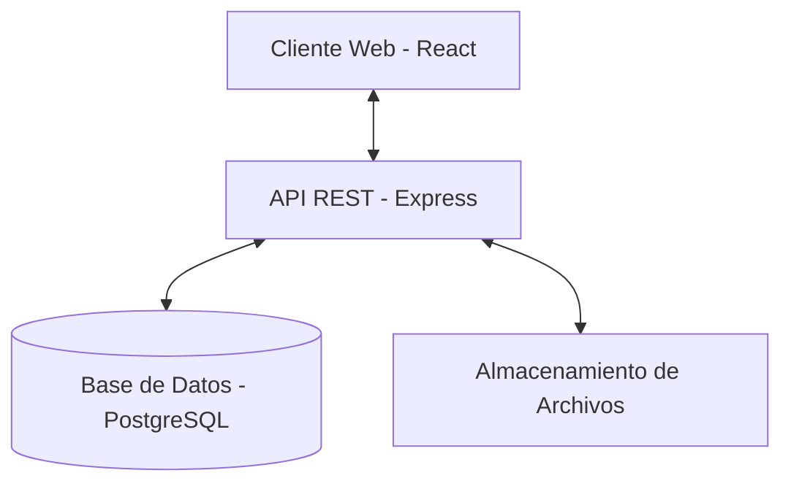
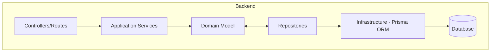

# Patrones del Sistema

## Arquitectura General

El Sistema de Seguimiento de Talento LTI sigue una arquitectura cliente-servidor con separación clara entre frontend y backend:



## Arquitectura del Backend

El backend sigue principios de Domain-Driven Design (DDD) con una arquitectura en capas:



### Estructura de Carpetas Backend

```
backend/
├── src/
│   ├── application/    # Servicios de aplicación
│   ├── domain/         # Modelos de dominio y lógica de negocio
│   ├── infrastructure/ # Implementaciones de repositorios y servicios técnicos
│   ├── presentation/   # Controladores y definición de rutas API
│   └── index.ts        # Punto de entrada de la aplicación
├── prisma/
│   └── schema.prisma   # Esquema de la base de datos
```

## Patrones de Diseño Clave

### 1. Domain-Driven Design (DDD)

El sistema implementa principios de DDD para modelar el dominio del negocio:

- **Entidades**: Objetos con identidad única (Candidate, Position, Interview)
- **Value Objects**: Objetos sin identidad propia (posiblemente Education, WorkExperience)
- **Agregados**: Conjuntos de entidades tratadas como unidad (Candidate es raíz de agregado)
- **Repositorios**: Encapsulan acceso a datos (CandidateRepository, PositionRepository)
- **Servicios de Dominio**: Encapsulan lógica de negocio compleja

### 2. Repository Pattern

Los repositorios abstraen el acceso a datos, permitiendo:

- Centralizar la lógica de acceso a datos
- Facilitar pruebas unitarias mediante mocks
- Desacoplar la lógica de negocio de la infraestructura de datos

```typescript
export interface CandidateRepository {
  findById(id: number): Promise<Candidate | null>;
  findAll(): Promise<Candidate[]>;
  save(candidate: Candidate): Promise<Candidate>;
  delete(id: number): Promise<void>;
}
```

### 3. Service Layer Pattern

Los servicios de aplicación coordinan operaciones complejas que involucran múltiples entidades o repositorios:

```typescript
export class CandidateApplicationService {
  constructor(
    private candidateRepo: CandidateRepository,
    private resumeRepo: ResumeRepository
  ) {}

  async createCandidateWithResume(candidateData, resumeData): Promise<Candidate> {
    // Lógica de coordinación entre múltiples repositorios
  }
}
```

### 4. Model-View-Controller (MVC)

El backend sigue un patrón MVC modificado:

- **Model**: Representado por los modelos de dominio y repositorios
- **View**: No hay views tradicionales, sino respuestas JSON de la API
- **Controller**: Controladores que manejan requests HTTP y delegan a los servicios

## Modelo de Datos

El sistema utiliza un modelo relacional gestionado por Prisma ORM. Las principales entidades son:

1. **Candidate**: Información de candidatos
2. **Education**: Historial educativo de candidatos
3. **WorkExperience**: Experiencia laboral de candidatos
4. **Resume**: Documentos CV asociados a candidatos
5. **Company**: Empresas que ofrecen posiciones
6. **Position**: Puestos de trabajo disponibles
7. **InterviewFlow**: Definición de procesos de entrevista
8. **InterviewStep**: Pasos individuales en un proceso de entrevista
9. **Application**: Aplicaciones de candidatos a posiciones
10. **Interview**: Resultados de entrevistas específicas

## Patrones de Integración

1. **API REST**: Interfaz principal entre frontend y backend
2. **DTOs**: Objetos de transferencia de datos para las comunicaciones API
3. **Middleware**: Para autenticación, validación y manejo de errores

## Patrones de Frontend

El frontend utiliza:

1. **Componentes React**: Estructura modular de la interfaz
2. **Gestión de Estado**: Posiblemente con Context API o Redux
3. **Hooks**: Para lógica reutilizable y efectos secundarios
4. **Formularios Controlados**: Para recopilación de datos de usuario
5. **Routing**: Para navegación entre diferentes vistas 